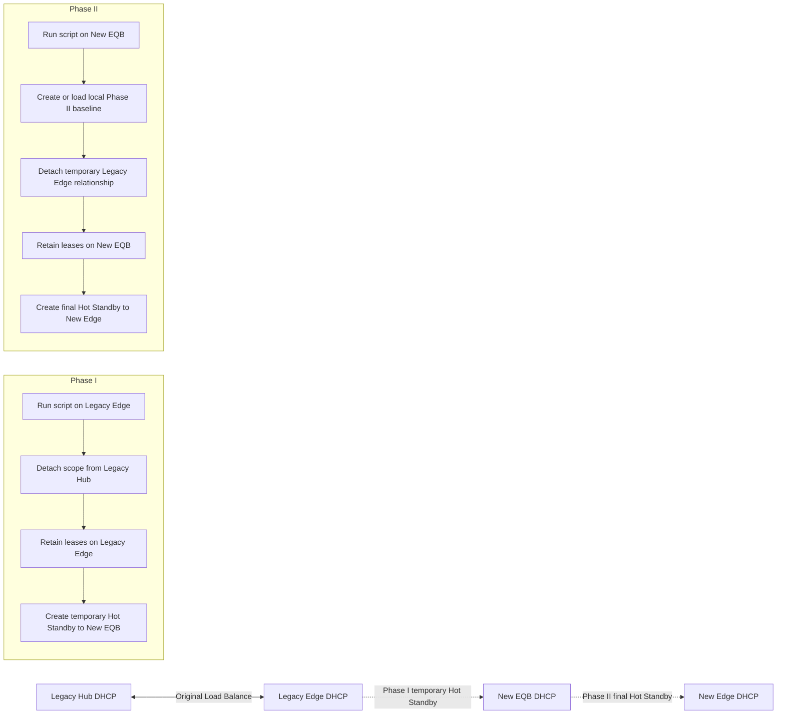
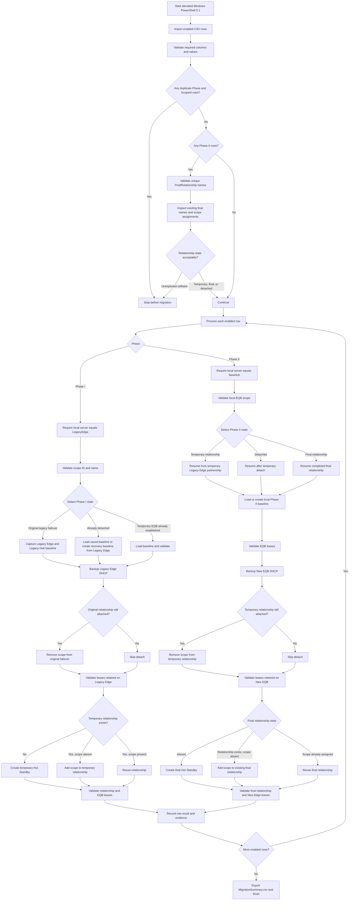

# DHCP Scope Bulk Migration Rev 1.0

Operator-focused PowerShell automation for moving Windows DHCP IPv4 scopes through a controlled, two-phase failover migration while preserving leases, reservations, backups, validation evidence, and resumability.

> **Script file:** `DHCP_Scope_Bulk_Migration_Rev1.0.ps1`  
> **CSV file:** `DHCP_Scope_Bulk_Migration_Rev1.0.csv`  
> **PowerShell requirement:** Windows PowerShell 5.1  
> **Execution model:** Run Phase I on the legacy Edge DHCP server, then run Phase II on the new EQB DHCP server

> The file names intentionally use `Bilk` because those are the requested release names. Keep the script and CSV file names consistent with this documentation.

---

## Overview

`DHCP_Scope_Bulk_Migration_Rev1.0.ps1` automates a staged Windows DHCP failover migration. Each CSV row describes one IPv4 scope and the four DHCP servers involved in the transition:

1. Legacy Hub DHCP server
2. Legacy Edge DHCP server
3. New EQB DHCP server
4. New Edge DHCP server

The migration is divided into two operational phases:

- **Phase I:** Run locally on the legacy Edge DHCP server. The script removes the scope from the original Legacy Hub and Legacy Edge failover relationship, retains the scope and leases on Legacy Edge, then establishes temporary Hot Standby failover between Legacy Edge and New EQB.
- **Phase II:** Run locally on the New EQB DHCP server. The script validates or creates a local Phase II lease baseline, removes the temporary Legacy Edge relationship, retains the scope and leases on New EQB, then establishes the final Hot Standby relationship between New EQB and New Edge.

The script is designed to be resumable. If a previous run completed only part of a phase, a later run detects the current relationship state and continues from the appropriate point instead of assuming every scope is still in its original state.

---

## Key Features

- CSV-driven migration of multiple DHCP IPv4 scopes
- Two-phase migration with explicit server placement
- Pre-change and post-change lease validation
- Reservation exports
- Local DHCP database backups before relationship changes
- Temporary and final Hot Standby relationship creation
- Resume-state detection for partially completed migrations
- Recovery baseline creation when Phase I files are not available on the Phase II server
- Unique final relationship-name validation before Phase II changes
- Existing relationship recovery and validation
- Per-scope failure evidence
- Continue-to-next-row behavior after a row-level failure
- Timestamped logs, comparisons, exports, backups, and summary files
- `-PreflightOnly`, `-WhatIf`, and `-Confirm` support through PowerShell common parameters

---

## Migration Architecture



### End State

After both phases complete successfully:

- The legacy failover relationship no longer owns the migrated scope.
- New EQB retains a complete copy of the scope, leases, and reservations.
- New Edge has the replicated scope, leases, and reservations.
- New EQB and New Edge participate in the uniquely named final Hot Standby relationship.

---

## Requirements

### Operating System and PowerShell

- Windows Server with the DHCP Server role or DHCP management tools
- Windows PowerShell 5.1
- Elevated Administrator session
- DHCP Server PowerShell module
- Network and RPC/CIM connectivity between the participating DHCP servers

### Permissions

The operator account must be able to:

- Read DHCP scopes, leases, reservations, and failover relationships
- Back up the local DHCP database
- Remove scopes from failover relationships
- Create failover relationships
- Add scopes to an existing failover relationship
- Trigger failover replication
- Read event logs and service status
- Write to the configured backup and output directories

### Operational Prerequisites

Before migration:

- Confirm all server names resolve through DNS.
- Confirm remote DHCP administration is permitted.
- Confirm the target scope exists on the expected source server.
- Confirm all active clients can tolerate the planned failover transition.
- Confirm the backup destination has sufficient free space.
- Confirm each final relationship name is unique for Phase II.
- Schedule the migration under an approved change record.
- Test the workflow in a nonproduction environment.

---

## Files

Place these files together in an operator staging directory such as `C:\Staging`:

```text
C:\Staging\DHCP_Scope_Bulk_Migration_Rev1.0.ps1
C:\Staging\DHCP_Scope_Bulk_Migration_Rev1.0.csv
```

The script does not require the files to be in `C:\Staging`, but all run examples in this documentation use that location.

---

## CSV Format

### Required Header

```csv
Enabled,Phase,ScopeId,ScopeName,LegacyHub,LegacyEdge,NewHub,NewEdge,ReservePercent,MCLT,TempRelationship,FinalRelationship,BackupRoot,OutputRoot,StopOnValidationFailure
```

### Example Phase I CSV

Use Phase `1` while running on the Legacy Edge DHCP server:

```csv
Enabled,Phase,ScopeId,ScopeName,LegacyHub,LegacyEdge,NewHub,NewEdge,ReservePercent,MCLT,TempRelationship,FinalRelationship,BackupRoot,OutputRoot,StopOnValidationFailure
TRUE,1,192.168.10.0,MigrationTestScope1,LegacyHub01,LegacyEdge01,NewEQB01,NewEdge01,10,00:05:00,LegacyEdge-NewEQB-HS,EQB-NewEdge-Scope10-HS,C:\DHCPMigration\Backup,C:\DHCPMigration\Results,FALSE
TRUE,1,192.168.20.0,MigrationTestScope2,LegacyHub01,LegacyEdge01,NewEQB01,NewEdge01,10,00:05:00,LegacyEdge-NewEQB-HS,EQB-NewEdge-Scope20-HS,C:\DHCPMigration\Backup,C:\DHCPMigration\Results,FALSE
```

### Example Phase II CSV

Before running on New EQB, change the `Phase` value to `2` for every scope intended for Phase II:

```csv
Enabled,Phase,ScopeId,ScopeName,LegacyHub,LegacyEdge,NewHub,NewEdge,ReservePercent,MCLT,TempRelationship,FinalRelationship,BackupRoot,OutputRoot,StopOnValidationFailure
TRUE,2,192.168.10.0,MigrationTestScope1,LegacyHub01,LegacyEdge01,NewEQB01,NewEdge01,10,00:05:00,LegacyEdge-NewEQB-HS,EQB-NewEdge-Scope10-HS,C:\DHCPMigration\Backup,C:\DHCPMigration\Results,FALSE
TRUE,2,192.168.20.0,MigrationTestScope2,LegacyHub01,LegacyEdge01,NewEQB01,NewEdge01,10,00:05:00,LegacyEdge-NewEQB-HS,EQB-NewEdge-Scope20-HS,C:\DHCPMigration\Backup,C:\DHCPMigration\Results,FALSE
```

> **Critical:** Do not run rows marked Phase `1` on New EQB. Do not run rows marked Phase `2` on Legacy Edge. The script validates the local server and stops the affected row when execution occurs on the wrong server.

---

## CSV Column Reference

### `Enabled`

Controls whether the row is imported for the current execution.

Accepted true values:

```text
TRUE
true
1
yes
y
```

Set the value to `FALSE` to leave a row in the CSV without processing it.

### `Phase`

Controls which workflow is executed.

```text
1 = Legacy Edge to New EQB temporary relationship
2 = New EQB to New Edge final relationship
```

Phase placement:

```text
Phase 1 must run locally on LegacyEdge.
Phase 2 must run locally on NewHub.
```

### `ScopeId`

The IPv4 network address of the DHCP scope, not the friendly scope name and not an assignable client address.

Correct examples:

```text
192.168.10.0
10.40.12.0
172.20.32.0
```

Incorrect examples:

```text
MigrationTestScope1
192.168.10.100
Scope-Users
```

The script validates that `ScopeId` is an IPv4 address and verifies the scope exists locally.

### `ScopeName`

The exact friendly name displayed by the Windows DHCP console. Matching is case-insensitive, but spelling, spaces, punctuation, and numbering must otherwise match.

Example:

```text
MigrationTestScope1
```

The script cross-checks `ScopeId` and `ScopeName` to prevent migration of the wrong scope.

### `LegacyHub`

The legacy centralized or hub DHCP server participating in the original failover relationship.

Example:

```text
LegacyHub01
```

A short host name or FQDN can be used, but consistent naming is recommended.

### `LegacyEdge`

The legacy Edge DHCP server on which Phase I must run. Phase I retains the scope and leases on this server after detaching the original failover relationship.

Example:

```text
LegacyEdge01
```

### `NewHub`

The new EQB DHCP server. This server is the temporary Phase I partner and the local execution server for Phase II.

Example:

```text
NewEQB01
```

### `NewEdge`

The final Edge DHCP partner created during Phase II.

Example:

```text
NewEdge01
```

### `ReservePercent`

The Hot Standby reserve percentage. The script accepts an integer from `1` through `50`.

Example:

```text
10
```

Use the value approved by the DHCP design owner. Do not change this solely to bypass validation.

### `MCLT`

Maximum Client Lead Time in a valid PowerShell `TimeSpan` format.

Recommended format:

```text
00:05:00
```

Meaning:

```text
hours:minutes:seconds
```

Additional examples:

```text
01:00:00
00:30:00
```

The value must be greater than zero.

### `TempRelationship`

Name of the temporary Phase I Hot Standby relationship between Legacy Edge and New EQB.

Multiple scopes may intentionally share this temporary relationship when all scopes use the same two temporary partner servers and settings.

Example:

```text
LegacyEdge-NewEQB-HS
```

The script can create this relationship for the first scope and add later scopes to the existing relationship.

### `FinalRelationship`

Name of the final Phase II Hot Standby relationship between New EQB and New Edge.

**Each enabled Phase II row must have a unique final relationship name.**

Correct:

```text
EQB-NewEdge-Scope10-HS
EQB-NewEdge-Scope20-HS
```

Incorrect:

```text
EQB-NewEdge-HS
EQB-NewEdge-HS
```

The script validates uniqueness before any Phase II DHCP changes. If the final name already exists, the script distinguishes among:

- The intended scope is already assigned to the final relationship: resume and validate.
- The scope is still assigned to the expected temporary relationship: continue Phase II.
- The final relationship exists without the intended scope: recover by adding the scope when mode and partner match.
- The scope is assigned to an unrelated relationship: stop that row as an unexpected collision.

### `BackupRoot`

Local or accessible directory used for DHCP database backups.

Example:

```text
C:\DHCPMigration\Backup
```

Backups are stored in timestamped subdirectories containing the local server and scope identifiers.

### `OutputRoot`

Directory used for run logs, lease exports, comparisons, summaries, and failure evidence.

Example:

```text
C:\DHCPMigration\Results
```

Phase II creates server-local recovery baselines here when Phase I baseline files are unavailable on New EQB.

### `StopOnValidationFailure`

Retained as a configuration and reporting field. The resumable workflow continues to later enabled rows after a row-level failure so an unrelated scope is not skipped.

Recommended value:

```text
FALSE
```

---

## Where to Run Each Phase

### Phase I

Run on the server specified by the row's `LegacyEdge` value.

```text
Execution server: LegacyEdge
Source relationship: LegacyHub <-> LegacyEdge
Temporary destination: LegacyEdge <-> NewHub
```

Example:

```powershell
Set-Location C:\Staging

.\DHCP_Scope_Bulk_Migration_Rev1.0.ps1 `
    -ConfigFile ".\DHCP_Scope_Bulk_Migration_Rev1.0.csv"
```

### Phase II

Run on the server specified by the row's `NewHub` value.

```text
Execution server: NewHub, also referred to as New EQB
Temporary relationship: LegacyEdge <-> NewHub
Final destination: NewHub <-> NewEdge
```

Change the CSV rows to `Phase=2`, copy the script and CSV to New EQB, and run:

```powershell
Set-Location C:\Staging

.\DHCP_Scope_Bulk_Migration_Rev1.0.ps1 `
    -ConfigFile ".\DHCP_Scope_Bulk_Migration_Rev1.0.csv"
```

---

## Recommended Operator Runbook

### 1. Prepare and validate the CSV

- Populate one row per scope.
- Use the scope network address in `ScopeId`.
- Match the exact DHCP display name in `ScopeName`.
- Verify all four server columns.
- Use a common `TempRelationship` only when intended.
- Assign a unique `FinalRelationship` to every Phase II row.
- Set `Phase=1` before the first execution.
- Set `Enabled=TRUE` only for scopes in the approved change.

### 2. Run Phase I preflight on Legacy Edge

```powershell
.\DHCP_Scope_Bulk_Migration_Rev1.0.ps1 `
    -ConfigFile ".\DHCP_Scope_Bulk_Migration_Rev1.0.csv" `
    -PreflightOnly
```

Review the output and evidence folder. Preflight validates state but does not perform the migration changes.

### 3. Run Phase I

```powershell
.\DHCP_Scope_Bulk_Migration_Rev1.0.ps1 `
    -ConfigFile ".\DHCP_Scope_Bulk_Migration_Rev1.0.csv"
```

Do not proceed to Phase II until every intended scope has a successful Phase I result or the failure has been reviewed and safely resumed.

### 4. Verify Phase I

```powershell
Get-DhcpServerv4Failover |
    Format-Table Name, Mode, PartnerServer, ScopeId -AutoSize
```

Verify lease counts on Legacy Edge and New EQB:

```powershell
foreach ($ScopeId in '192.168.10.0','192.168.20.0') {
    [pscustomobject]@{
        ScopeId = $ScopeId
        LegacyEdgeLeases = @(Get-DhcpServerv4Lease -ComputerName 'LegacyEdge01' -ScopeId $ScopeId -AllLeases).Count
        NewEQBLeases = @(Get-DhcpServerv4Lease -ComputerName 'NewEQB01' -ScopeId $ScopeId -AllLeases).Count
    }
}
```

### 5. Prepare Phase II

- Change the intended rows from `Phase=1` to `Phase=2`.
- Confirm `FinalRelationship` values are unique.
- Copy the script and updated CSV to New EQB.
- Do not manually remove the temporary relationship merely because Phase II has not run yet.

### 6. Run Phase II preflight on New EQB

```powershell
.\DHCP_Scope_Bulk_Migration_Rev1.0.ps1 `
    -ConfigFile ".\DHCP_Scope_Bulk_Migration_Rev1.0.csv" `
    -PreflightOnly
```

### 7. Run Phase II

```powershell
.\DHCP_Scope_Bulk_Migration_Rev1.0.ps1 `
    -ConfigFile ".\DHCP_Scope_Bulk_Migration_Rev1.0.csv"
```

### 8. Verify final state

```powershell
Get-DhcpServerv4Failover |
    Format-Table Name, Mode, ServerRole, PartnerServer, ScopeId -AutoSize
```

Verify lease counts on New EQB and New Edge:

```powershell
foreach ($ScopeId in '192.168.10.0','192.168.20.0') {
    [pscustomobject]@{
        ScopeId = $ScopeId
        NewEQBLeases = @(Get-DhcpServerv4Lease -ComputerName 'NewEQB01' -ScopeId $ScopeId -AllLeases).Count
        NewEdgeLeases = @(Get-DhcpServerv4Lease -ComputerName 'NewEdge01' -ScopeId $ScopeId -AllLeases).Count
    }
}
```

---

## Detailed Workflow



---

## Outputs

Each run creates a timestamped directory under `OutputRoot`:

```text
C:\DHCPMigration\Results\Run_YYYYMMDD_HHMMSS
```

Typical contents include:

```text
Migration.log
MigrationSummary.csv
Phase1_<ScopeName>_<ScopeId>\
Phase2_<ScopeName>_<ScopeId>\
FAILURE.csv
FAILURE.txt
```

Per-scope evidence can include:

- Lease exports before and after detach
- Reservation exports
- Consolidated baselines
- Local Phase II baselines
- Lease comparison CSV files
- Temporary and final failover relationship details
- Scope statistics
- Recent warning and error events
- Database settings

Backups are written below `BackupRoot` using a pattern similar to:

```text
DHCP_<LocalServer>_<ScopeId>_YYYYMMDD_HHMMSS
```

---

## Resume Behavior

### Phase I states

- `OriginalLegacyFailover`: Original Load Balance relationship is still present.
- `Detached`: Original relationship was already removed.
- `TemporaryEQBFailoverEstablished`: Temporary Legacy Edge and New EQB relationship already exists.

### Phase II states

- `TemporaryLegacyEdgeFailover`: Scope is still in the expected temporary relationship.
- `DetachedFromLegacyEdge`: Temporary scope relationship was already removed.
- `FinalNewEdgeFailoverEstablished`: Final New EQB and New Edge relationship is already present.

The script treats these states as resumable. An unexpected relationship name, mode, or partner is treated as a safety exception.

---

## Troubleshooting

### Script says it is running on the wrong server

Verify the CSV phase and execution host:

```text
Phase 1 -> run on LegacyEdge
Phase 2 -> run on NewHub
```

### Scope ID and scope name do not match

Open DHCP Manager and copy:

- The scope network address into `ScopeId`
- The displayed scope name into `ScopeName`

### Phase II baseline does not exist

This is expected when Phase II runs on a different server and the Phase I output was not copied. The script creates:

```text
Phase2Baseline_<ScopeId>.csv
```

from leases retained locally on New EQB before making Phase II changes.

### Duplicate final relationship names

Assign a distinct `FinalRelationship` to each enabled Phase II scope. Do not reuse the same final name across rows.

### Scope is still in the temporary relationship

This is an expected Phase II starting state. Do not remove it manually. The script validates the baseline and backup before removing the scope.

### Final relationship exists but scope is absent

The script verifies mode and partner, then attempts to add the intended scope to the existing final relationship.

### One row fails and later rows continue

This is intentional. Review:

```text
MigrationSummary.csv
FAILURE.csv
FAILURE.txt
Migration.log
```

Correct the condition and rerun. Successfully completed scopes should be detected as resumable or completed.

### `State` or `RelationshipState` is unavailable

Some DHCP module versions do not expose both properties consistently. The script checks available properties and continues to authoritative scope and lease validation when the relationship exists on both partners.

---

## Safety and Change Control

- Always run from an elevated session.
- Use `-PreflightOnly` before production changes.
- Use `-WhatIf` as an additional review mechanism, but remember that some read-only validation still runs.
- Never delete scopes or relationship objects manually merely to make the script continue.
- Review failure evidence before rerunning.
- Protect logs and exports because they contain infrastructure names, IP networks, DHCP client IDs, host names, and lease information.
- Retain backups and run evidence according to organizational policy.
- Test rollback procedures before production use.

---

## Release Notes

### Rev 1.0

- Two-phase DHCP scope migration
- CSV-driven multi-scope operation
- Original, detached, temporary, and final relationship resume states
- Local Phase II baseline recovery
- Unique final relationship validation
- Existing relationship and scope recovery
- Lease and reservation evidence
- DHCP backups
- Per-row continuation and failure records
- Detailed operator logging

