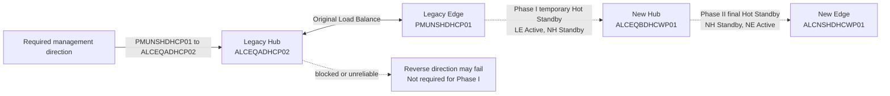
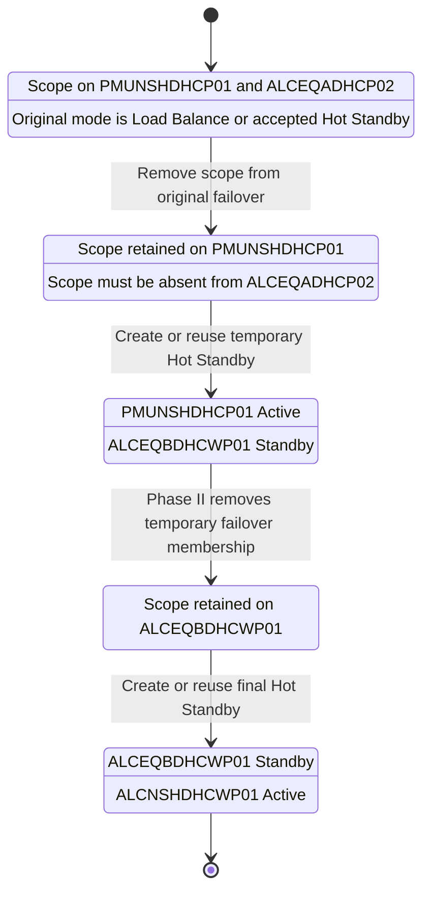
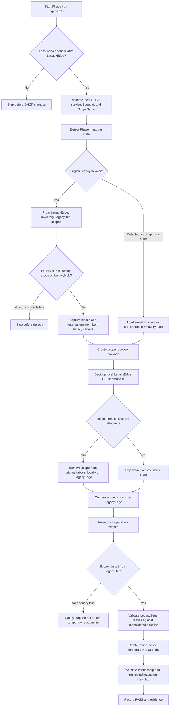
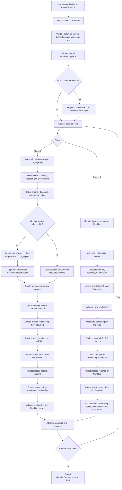

# DHCP Scope Bulk Migration Rev 2.4

Operator-focused PowerShell automation for moving Windows DHCP IPv4 scopes through a controlled, two-phase failover migration while preserving scopes, leases, reservations, backups, validation evidence, and resumability.

## Release Files

- **Script:** `DHCP_Scope_Bulk_Migration_Rev2.4.ps1`
- **Phase I CSV:** `DHCP_Wave4_Day1_P1_Rev2.4.csv`
- **Phase II CSV:** `DHCP_Wave4_Day1_P2_Rev2.4.csv`
- **PowerShell:** Windows PowerShell 5.1
- **Phase I execution server:** The server specified in `LegacyEdge`
- **Phase II execution server:** The server specified in `NewHub`

If the downloaded script has a `.txt` suffix, rename it before execution:

```powershell
Rename-Item `
    .\DHCP_Scope_Bulk_Migration_Rev2.4.ps1.txt `
    DHCP_Scope_Bulk_Migration_Rev2.4.ps1
```

## Purpose

The script migrates each enabled DHCP scope through two controlled failover transitions:

1. **Phase I:** Remove the scope from the original Legacy Hub and Legacy Edge failover relationship while retaining the scope on Legacy Edge. Then create or reuse a temporary Hot Standby relationship between Legacy Edge and New Hub.
2. **Phase II:** Remove the scope from the temporary Legacy Edge and New Hub relationship while retaining the scope on New Hub. Then create or reuse the final Hot Standby relationship between New Hub and New Edge.

Rev 2.4 also supports an environment in which DHCP failover management or partner-status communication is asymmetric. Phase I is intentionally anchored to the retained Legacy Edge and requires only the management direction needed by the workflow.

## Environment-Specific Server Mapping

For the current Nashville migration wave, the required mapping is:

| CSV column | Server | Purpose |
|---|---|---|
| `LegacyHub` | `ALCEQADHCP02` | Original centralized DHCP failover partner that must no longer contain the scope after Phase I detach |
| `LegacyEdge` | `PMUNSHDHCP01` | Authoritative retained legacy server and Phase I execution server |
| `NewHub` | `ALCEQBDHCWP01` | Temporary Phase I partner and Phase II execution server |
| `NewEdge` | `ALCNSHDHCWP01` | Final active Edge partner |

> **Critical:** Do not reverse `LegacyHub` and `LegacyEdge`. Phase I must run on `PMUNSHDHCP01`, because the scope must remain on `PMUNSHDHCP01` when the original load-balance failover membership is removed.

## Firewall and Connectivity Constraint

The known condition is asymmetric communication between `ALCEQADHCP02` and edge DHCP servers such as `PMUNSHDHCP01`:

- A failover relationship can exist between the servers.
- The relationship may report **Normal** when viewed from the edge side.
- The legacy hub side may show the partner state as **Not available** or **Unknown**.
- Remote DHCP queries initiated in the hub-to-edge direction may fail.
- The network path cannot be changed as part of this migration.

Rev 2.4 works around this condition without suppressing placement, lease, or backup safeguards:

- Phase I runs locally on `PMUNSHDHCP01`.
- Required remote checks are initiated from `PMUNSHDHCP01` toward `ALCEQADHCP02`.
- Reverse-direction partner-status visibility is not required by the Phase I workflow.
- A transport failure in the required edge-to-hub direction remains a hard stop.
- The script proves the scope exists on `PMUNSHDHCP01` and is absent from `ALCEQADHCP02` after detach.
- The temporary relationship is not created if scope placement cannot be proven.

## Migration Architecture



## Scope Placement by Stage



## Rev 2.4 Phase I Safety Flow



## Key Features

- CSV-driven migration of multiple DHCP IPv4 scopes
- Two-phase migration with explicit source and destination placement
- Corrected `LegacyHub` and `LegacyEdge` semantics
- Phase I local-execution enforcement on `LegacyEdge`
- Required-direction management validation from Legacy Edge to Legacy Hub
- Full Legacy Hub scope-inventory checks to distinguish an absent scope from a failed query
- Explicit post-detach proof that the scope remains on Legacy Edge and is absent from Legacy Hub
- Consolidated lease baseline from both legacy failover partners
- Per-scope XML recovery export with leases
- Lease and reservation CSV exports
- Local DHCP database backup before relationship changes
- Temporary and final Hot Standby creation or reuse
- Relationship action controls: `Auto`, `Reuse`, and `Create`
- Resume-state detection for partially completed migrations
- Phase II local baseline recovery
- Shared temporary and final relationship validation for a single server pair
- Retry and replication handling when adding scopes to existing relationships
- Approved zero-lease scope handling through `AllowZeroLeases`
- Continue-to-next-row behavior by default
- Optional batch stop through `-StopBatchOnRowError`
- Timestamped logs, comparisons, exports, failure records, and summaries
- `-PreflightOnly`, `-WhatIf`, and `-Confirm` support

## Requirements

### Platform

- Windows Server with the DHCP Server role or DHCP management tools
- Windows PowerShell 5.1
- Elevated Administrator session
- `DhcpServer` PowerShell module

### Permissions

The operator account must be able to:

- Read scopes, leases, reservations, and failover relationships
- Query the Legacy Hub from the Legacy Edge
- Back up the local DHCP database
- Export individual scopes with leases
- Remove scopes from failover relationships
- Create failover relationships
- Add scopes to existing relationships
- Trigger failover replication
- Read local service status and event logs
- Write to `BackupRoot` and `OutputRoot`

### Network Path

Phase I requires successful DHCP management calls in this direction:

```text
LegacyEdge -> LegacyHub
PMUNSHDHCP01 -> ALCEQADHCP02
```

The script does not require `ALCEQADHCP02` to initiate remote DHCP management queries toward `PMUNSHDHCP01`. However, normal DHCP failover replication must work for any relationship being created or validated.

## CSV Format

### Header

```csv
Enabled,Phase,ScopeId,ScopeName,LegacyHub,LegacyEdge,NewHub,NewEdge,ReservePercent,MCLT,TempRelationship,TempRelationshipAction,FinalRelationship,RelationshipAction,BackupRoot,OutputRoot,StopOnValidationFailure,AllowZeroLeases
```

### Nashville Phase I Example

```csv
Enabled,Phase,ScopeId,ScopeName,LegacyHub,LegacyEdge,NewHub,NewEdge,ReservePercent,MCLT,TempRelationship,TempRelationshipAction,FinalRelationship,RelationshipAction,BackupRoot,OutputRoot,StopOnValidationFailure,AllowZeroLeases
TRUE,1,10.90.151.0,TN-Nashville-NSH-Main-Pouch-Voice,ALCEQADHCP02,PMUNSHDHCP01,ALCEQBDHCWP01,ALCNSHDHCWP01,10,0:05:00,Migrate Temp NSH,Auto,NSH to EQB Active,Auto,C:\DHCPMigration\Backup,C:\DHCPMigration\Results,FALSE,TRUE
```

### Nashville Phase II Example

```csv
Enabled,Phase,ScopeId,ScopeName,LegacyHub,LegacyEdge,NewHub,NewEdge,ReservePercent,MCLT,TempRelationship,TempRelationshipAction,FinalRelationship,RelationshipAction,BackupRoot,OutputRoot,StopOnValidationFailure,AllowZeroLeases
TRUE,2,10.90.151.0,TN-Nashville-NSH-Main-Pouch-Voice,ALCEQADHCP02,PMUNSHDHCP01,ALCEQBDHCWP01,ALCNSHDHCWP01,10,0:05:00,Migrate Temp NSH,Auto,NSH to EQB Active,Auto,C:\DHCPMigration\Backup,C:\DHCPMigration\Results,FALSE,TRUE
```

## CSV Column Reference

### `Enabled`

Controls whether the row is processed. Accepted true values are `TRUE`, `true`, `1`, `yes`, and `y`.

### `Phase`

- `1`: Legacy Edge to New Hub temporary relationship
- `2`: New Hub to New Edge final relationship

Phase I must run on `LegacyEdge`. Phase II must run on `NewHub`.

### `ScopeId`

IPv4 scope network address, such as `10.90.151.0`. Do not use a friendly name or assignable client address.

### `ScopeName`

Exact friendly name displayed by Windows DHCP Manager. Comparison is case-insensitive, but spelling, spaces, punctuation, and numbering must match.

### `LegacyHub`

Original centralized partner that must no longer contain the scope after Phase I detach. For this wave, use `ALCEQADHCP02`.

### `LegacyEdge`

Retained source server and required Phase I execution server. For this wave, use `PMUNSHDHCP01`.

### `NewHub`

Temporary Phase I partner and required Phase II execution server. For this wave, use `ALCEQBDHCWP01`.

### `NewEdge`

Final Edge partner. For this wave, use `ALCNSHDHCWP01`.

### `ReservePercent`

Hot Standby reserve percentage from 1 through 50.

### `MCLT`

Maximum Client Lead Time in PowerShell `TimeSpan` format, such as `0:05:00` or `00:05:00`. The value must be greater than zero.

### `TempRelationship`

Temporary relationship name between `LegacyEdge` and `NewHub`. Multiple scopes may share the name only when the same server pair is used.

### `TempRelationshipAction`

- `Auto`: Reuse a matching relationship or create it if absent
- `Reuse`: Require the relationship to exist
- `Create`: Require the relationship name to be unused

### `FinalRelationship`

Final relationship name between `NewHub` and `NewEdge`. Rev 2.4 permits a shared final relationship across multiple scopes when all affected rows use the same server pair and compatible plan.

### `RelationshipAction`

Controls final relationship behavior using `Auto`, `Reuse`, or `Create`.

### `BackupRoot`

Destination for local database backups and per-scope recovery packages.

### `OutputRoot`

Destination for run logs, baselines, lease comparisons, summaries, and failure evidence.

### `StopOnValidationFailure`

Backward-compatible row behavior. `TRUE` stops after a row failure. `FALSE` allows later enabled rows to continue unless `-StopBatchOnRowError` is supplied.

### `AllowZeroLeases`

Set to `TRUE` only for a scope approved to contain zero leases. This does not bypass scope, relationship, backup, or placement checks.

## Operator Runbook

### 1. Stage the files

Place the script and applicable CSV together, for example:

```text
C:\Staging\DHCP_Scope_Bulk_Migration_Rev2.4.ps1
C:\Staging\DHCP_Wave4_Day1_P1_Rev2.4.csv
C:\Staging\DHCP_Wave4_Day1_P2_Rev2.4.csv
```

### 2. Run Phase I preflight on PMUNSHDHCP01

```powershell
Set-Location C:\Staging

.\DHCP_Scope_Bulk_Migration_Rev2.4.ps1 `
    -ConfigFile .\DHCP_Wave4_Day1_P1_Rev2.4.csv `
    -PreflightOnly
```

Review the log and confirm that:

- The local execution server is `PMUNSHDHCP01`.
- The scope ID and name match.
- The original partner is `ALCEQADHCP02`.
- Legacy Edge to Legacy Hub management validation passes.
- Scope and lease baselines are captured successfully.

### 3. Run Phase I

```powershell
.\DHCP_Scope_Bulk_Migration_Rev2.4.ps1 `
    -ConfigFile .\DHCP_Wave4_Day1_P1_Rev2.4.csv
```

Phase I will not create the temporary relationship until the script proves that the scope remains on `PMUNSHDHCP01` and is absent from `ALCEQADHCP02`.

### 4. Verify Phase I

Run locally on `PMUNSHDHCP01`:

```powershell
Get-DhcpServerv4Failover |
    Format-Table Name, Mode, PartnerServer, ScopeId -AutoSize
```

Verify placement for a scope:

```powershell
$scopeId = '10.90.151.0'

[pscustomobject]@{
    ScopeId            = $scopeId
    LegacyEdgePresent  = [bool](Get-DhcpServerv4Scope -ComputerName 'PMUNSHDHCP01' -ScopeId $scopeId -ErrorAction SilentlyContinue)
    LegacyHubPresent   = [bool](Get-DhcpServerv4Scope -ComputerName 'ALCEQADHCP02' -ScopeId $scopeId -ErrorAction SilentlyContinue)
    LegacyEdgeLeases   = @(Get-DhcpServerv4Lease -ComputerName 'PMUNSHDHCP01' -ScopeId $scopeId -AllLeases).Count
    NewHubLeases       = @(Get-DhcpServerv4Lease -ComputerName 'ALCEQBDHCWP01' -ScopeId $scopeId -AllLeases).Count
}
```

Expected Phase I placement:

```text
PMUNSHDHCP01: scope present
ALCEQADHCP02: scope absent
ALCEQBDHCWP01: replicated temporary copy present
```

### 5. Run Phase II preflight on ALCEQBDHCWP01

```powershell
Set-Location C:\Staging

.\DHCP_Scope_Bulk_Migration_Rev2.4.ps1 `
    -ConfigFile .\DHCP_Wave4_Day1_P2_Rev2.4.csv `
    -PreflightOnly
```

### 6. Run Phase II

```powershell
.\DHCP_Scope_Bulk_Migration_Rev2.4.ps1 `
    -ConfigFile .\DHCP_Wave4_Day1_P2_Rev2.4.csv
```

### 7. Verify the final state

Run locally on `ALCEQBDHCWP01`:

```powershell
Get-DhcpServerv4Failover |
    Format-Table Name, Mode, ServerRole, PartnerServer, ScopeId -AutoSize
```

Expected final placement:

```text
ALCEQBDHCWP01: scope present, Standby role
ALCNSHDHCWP01: scope present, Active role
PMUNSHDHCP01: no longer the final failover partner
ALCEQADHCP02: scope absent
```

## Detailed End-to-End Workflow



## Outputs and Evidence

Each execution creates a timestamped directory:

```text
C:\DHCPMigration\Results\Run_YYYYMMDD_HHMMSS
```

Typical contents include:

```text
Migration.log
MigrationSummary.csv
Phase1_<ScopeName>_<ScopeId>\
Phase2_<ScopeName>_<ScopeId>\
FAILURE.csv
FAILURE.txt
```

Per-scope evidence can include:

- Legacy Edge and Legacy Hub lease exports
- Reservation exports
- Consolidated lease baselines
- Phase II local baselines
- Before-and-after lease comparisons
- Temporary and final relationship details
- DHCP database settings
- Scope statistics
- Recent warning and error events
- Per-scope recovery package manifest and hashes

## Resume States

### Phase I

- `OriginalLegacyFailover`: Original Load Balance or accepted Hot Standby relationship is present with the configured Legacy Hub.
- `Detached`: No scope failover relationship is present. The retained Legacy Edge is authoritative.
- `TemporaryEQBFailoverEstablished`: Expected temporary Hot Standby relationship already exists between Legacy Edge and New Hub.

### Phase II

- `TemporaryLegacyEdgeFailover`: Scope remains in the expected temporary relationship.
- `DetachedFromLegacyEdge`: Temporary relationship has already been removed and the scope is retained on New Hub.
- `FinalNewEdgeFailoverEstablished`: Expected final relationship already exists between New Hub and New Edge.

Unexpected relationship names, modes, partners, or roles cause a safety stop for the affected row.

## Troubleshooting

### Phase I reports the wrong execution server

Confirm:

```text
LegacyHub  = ALCEQADHCP02
LegacyEdge = PMUNSHDHCP01
```

Run Phase I on `PMUNSHDHCP01`, not `ALCEQADHCP02`.

### Legacy Hub query fails before detach

The required path from `PMUNSHDHCP01` to `ALCEQADHCP02` is unavailable. The script stops before making DHCP changes. Do not bypass this check because the script must capture the consolidated source baseline and later prove removal from the Legacy Hub.

### Partner state is Not available or Unknown

Asymmetric partner-status visibility is expected in the known firewall condition. The script does not rely exclusively on the remote partner-status display. Scope presence, failover membership, lease replication, server role, and lease baseline checks are used as authoritative validations where applicable.

A failure of a required management command remains a hard stop. Rev 2.4 does not convert transport failures into successful validation.

### Scope remains on ALCEQADHCP02 after detach

The script stops before creating the temporary relationship. Review the failure records and DHCP state. Do not manually continue to Phase II.

### Scope exists locally but direct remote `-ScopeId` lookup says it is unavailable

Rev 2.4 uses a full Legacy Hub scope inventory for placement checks. A successful inventory with no matching scope proves absence. A failed inventory call indicates a transport or permission problem and stops the row.

### No leases are present

Set `AllowZeroLeases=TRUE` only when the empty scope is expected and approved. Recovery XML, scope configuration, reservation evidence, and placement checks still apply.

### A row fails and later rows continue

This is the default behavior. Review:

```text
MigrationSummary.csv
FAILURE.csv
FAILURE.txt
Migration.log
```

Use `-StopBatchOnRowError` when the entire batch must stop after the first failed row.

## Safety and Change Control

- Run from an elevated Windows PowerShell 5.1 session.
- Run `-PreflightOnly` before each production phase.
- Use the matching Phase I and Phase II CSV files.
- Never run Phase I from `ALCEQADHCP02` for this migration wave.
- Do not manually delete scopes or failover relationships to force progress.
- Do not suppress required Legacy Edge to Legacy Hub management failures.
- Review backups, recovery exports, baselines, and failure evidence before rerunning.
- Protect logs and exports because they contain infrastructure names, networks, DHCP client identifiers, host names, and lease data.
- Retain evidence according to organizational change-control and data-retention requirements.

## Release Notes

### Rev 2.4

- Corrected the Nashville CSV mapping so `ALCEQADHCP02` is `LegacyHub` and `PMUNSHDHCP01` is `LegacyEdge`.
- Anchored Phase I execution to the server that must retain the scope.
- Added Legacy Edge to Legacy Hub management-direction validation before detach.
- Added full Legacy Hub scope-inventory lookup to distinguish absence from query failure.
- Added post-detach proof that the scope remains on Legacy Edge.
- Added post-detach proof that the scope is absent from Legacy Hub.
- Added a safety stop that prevents temporary relationship creation if the scope remains on Legacy Hub or placement cannot be verified.
- Documented the asymmetric firewall and partner-status condition.
- Preserved lease baselines, recovery exports, backups, retry behavior, relationship validation, and resumability.

### Rev 2.3

- Phase II creates New Hub as Standby and New Edge as Active.
- Added final role validation.

### Rev 2.2

- Continue-on-row-error is enabled by default.
- Supports `ContinueOnError`, `ContinueOnErrors`, and backward-compatible row controls.

### Rev 2.1

- Added flexible source states, shared relationships, relationship retries, replication attempts, and configurable row delays.

### Rev 1.7

- Added explicitly approved zero-lease scope handling.

### Rev 1.6

- Added robust lease capture, per-scope recovery exports, and validated replication.
